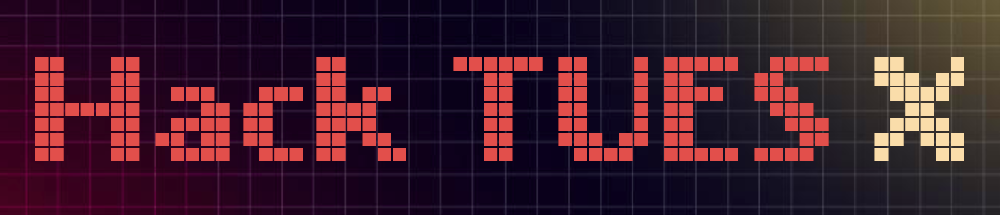
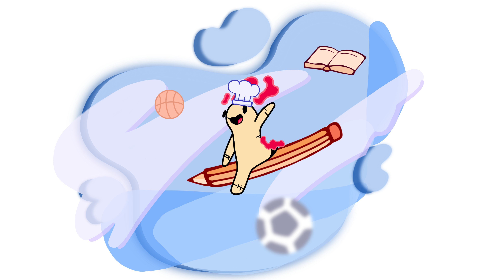
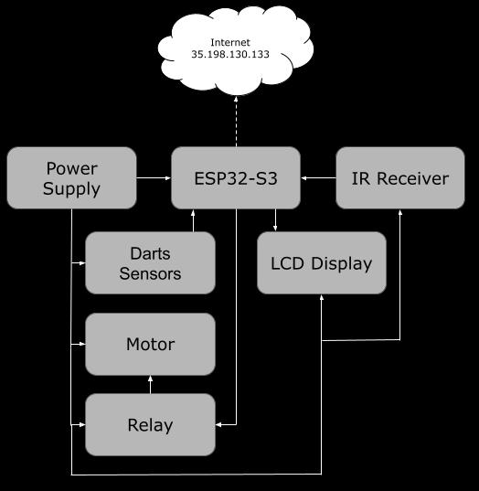
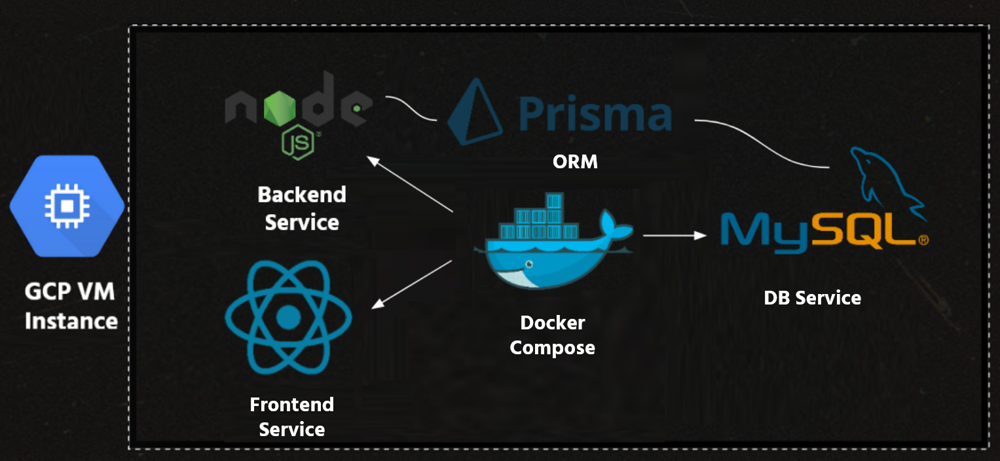
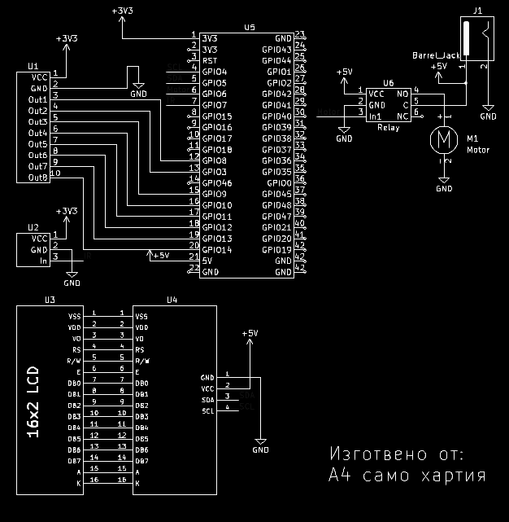

# DartSense
## от "А4 само хартия"

DartsSense ще автоматизира аспекти от играта на дартс, предоставяйки на играчите в реално време информация за тяхната точност и техника. Така ще бъдат подобрени тренировките и играчите ще могат да развият по-добри умения в играта.

## HackTUES X: Hack Your Hobby

## Съдържание

1. [Функции](#функции)
2. [Презентация](#презентация)
3. [Демонстрация](#демонстрация)
4. [Използвани технологии](#използвани-технологии)
5. [Блокови схеми](#блокови-схеми)
6. [Принципна електрическа схема](#принципна-електрическа-схема)
7. [А4 само хартия](#а4-само-хартия)

## Функции

## Презентация
/presentation/DartsSense.pdf

## Демонстрация
- [DockerHub Repo Backend](https://hub.docker.com/repository/docker/emiliyata/dart-sense-backend/tags?page=1&ordering=last_updated)
 - [DockerHub Repo Frontend](https://hub.docker.com/repository/docker/emiliyata/dart-sense-frontend/general)

## Използвани технологии

- **ESP32**
- **C**
- **KiCAD**
- **Reverse Engineering**
- **React**
- **Docker**
- **MySQL**
- **Prisma**
- **NodeJS**

## Блокови схеми

## Принципна електрическа схема

## А4 само хартия

- [Викторио Миланов (12Г)](https://github.com/milanovviktorio)
- [Емилия Чукалева (12Г)](https://github.com/michislava)
- [Любомир Станев (12Г)](https://github.com/liubo817)
- [Николай Йорданов (12Г)](https://github.com/i-kratko)
